# Introduction

This lab will give you an overview of how NGINX One provides visibility
into a global fleet of NGINX instances, both NGINX Plus and NGINX OSS.

NGINX One is currently in Early Access, and the implemented feature set
it limited; however, you will still be able to see the onboarding
process, as well as some of the metrics and insights that the platform
is able to provide. The features and capabilities of the NGINX One
offering are expected to continue to grow up to and beyond General
Availability.

After this lab, you will be able to:

- Access and navigate the NGINX One console,

- Install the NGINX Agent on both NGINX Plus and NGINX OSS instances,
  and

- Review recommendations from the NGINX One console

## Prerequisites

### F5 Distributed Cloud Access

You will use your existing F5 XC Sales tenant to complete this lab. If
you do not have access to F5 XC, work with your SE team to get
onboarded.

### UDF Blueprint

The “TechXchange 2024 – NGINX One” blueprint contains the NGINX Plus and
NGINX OSS instances that you will use during this lab. You should be
comfortable accessing resources in UDF using SSH.

# Lab 1: Accessing the NGINX One Console

1.  Log into your F5 Distributed Cloud Sales tenant.

2.  Select the “NGINX One” product from the home screen.

<!--

    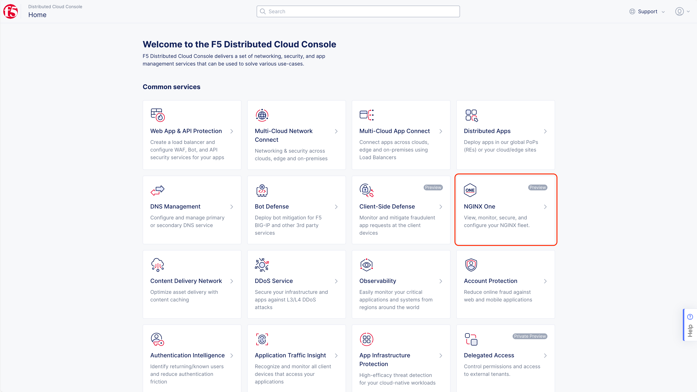

3.  The NGINX One welcome screen will appear. Click “Visit Service” to
    process to the NGINX One console.

    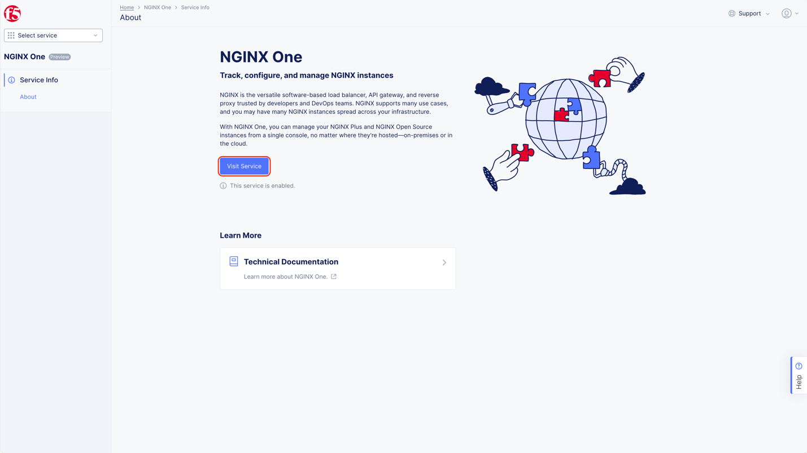

4.  The NGINX One Dashboard shows an overview of your environment,
    including availability, platform and version distribution, and
    CVEs/configuration recommendations. Your dashboard will vary
    depending on what is installed in your tenant. Feel free to click
    around and explore.

    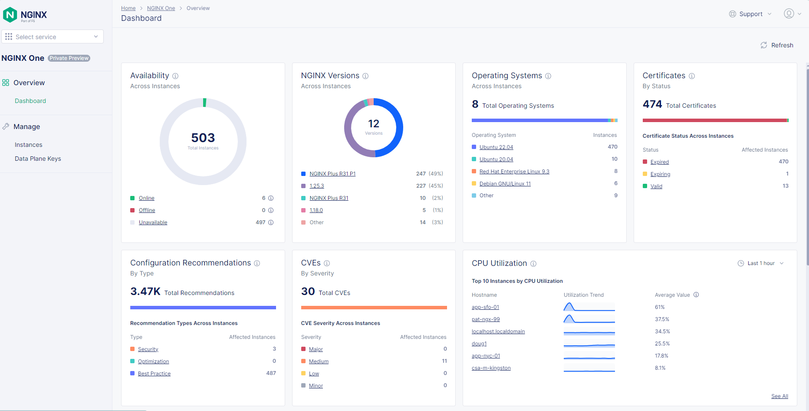

5.  In the left-hand menu in the “Manage” section is the “Instances”
    link. You may or may not have any existing instances in your tenant.
    Don’t worry if there aren’t any, you will be deploying two instances
    later in the lab. If there are any existing instances, click an
    instance’s hostname to view its details.

    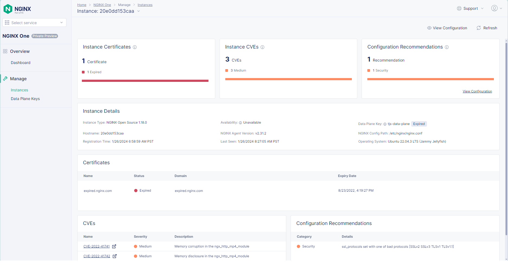

6.  Review the following demo for an overview of the types of data and
    findings available from the NGINX One Dashboard:

    [Vivun Demo Automation - NGINX One](https://app.revel.vivun.com/demos/13885df7-5333-4182-8d57-fcba3d0cbd28/paths/4be83a03-f942-4eb2-80db-174046d15e0c)

    > :point_right: **Note:** You may experience rendering issues viewing the
    > demo on a smaller screen. Try maximizing your browser window if you
    > experience any issues.

# Lab 2: Connecting NGINX Plus to NGINX One

NGINX One uses an agent installed alongside NGINX to communicate with
the NGINX One service.

    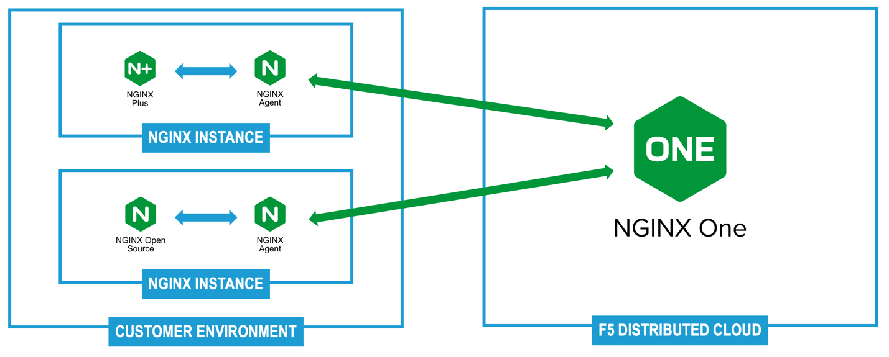

The agent uses a Data Plane Key to authenticate and identify itself to
NGINX One. In this lab we will create a new Data Plane Key, and use it
to install the NGINX Agent on the NGINX Plus instance.

## Connecting to the lab environment.

The requirements for this lab are minimal. If you prefer working
directly from your workstation, you can SSH directly into the lab
machines. If you would rather work from a jumphost, that option is
available as well.

### Option 1: Direct access

1.  Navigate to the “Components” tab in UDF.

2.  Under the “Systems” column, find the system you want to connect to
    and drop down the “Access Methods” option.

3.  Click the “SSH (47000)” option. If your computer is configured with
    a handler for the SSH protocol, your SSH client should open
    automatically.

### Option 2: Jumphost

1.  Navigate to the “Components” tab in UDF.

2.  Under the “Systems” column, find the “Linux Jumphost” system and
    drop down the “Access Methods” option.

3.  Click the “RDP” option. Depending on your computer’s configuration,
    either your RDP Client will open automatically, or it will download
    a .rdp file and you will need to double-click it to connect.

4.  Log into the jumphost with the username “user” and password “user”.

    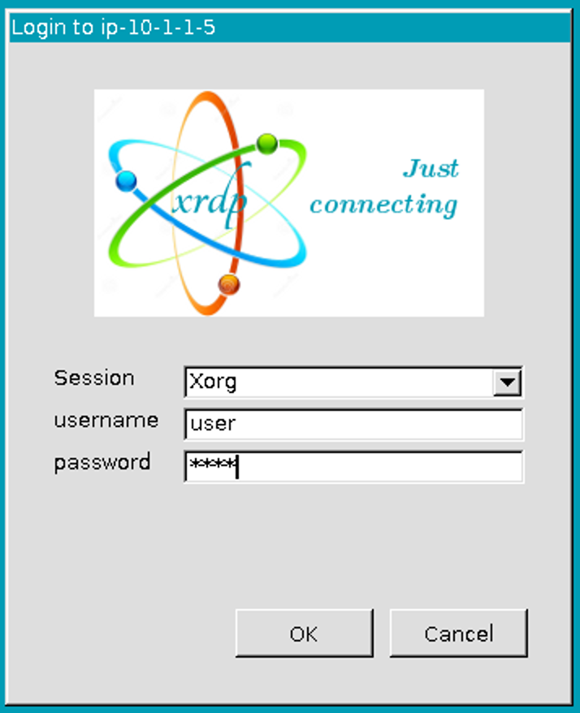

5.  Click the “Terminal Emulator” icon in the dock to open a terminal.

6.  Enter the following command, substituting “\<ip address”\> with the
    address of the system you are connecting to.

    ```bash
ssh ubuntu@<ip address>
    ```

    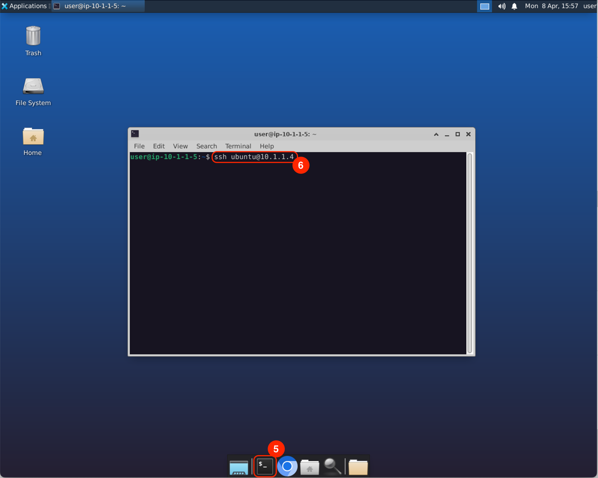

## Generating a Data Plane Key

1.  From the NGINX One console, in the left hand menu under the “Manage”
    section, select “Data Pane Keys”.

2.  Click “Add Data Plane Key”.

3.  Give the key a name. Other users in your tenant will see this
    object, so be sure to name it in a way that identifies it as yours.
    A suggested format is “\<yourname\>-techxchange-nginx-plus-key”.

    > :point_right: **Note:** You are working in a shared tenant; keep
    > track of your resources, and be careful not to accidently modify
    > anyone else's.

4.  Click “Generate”

    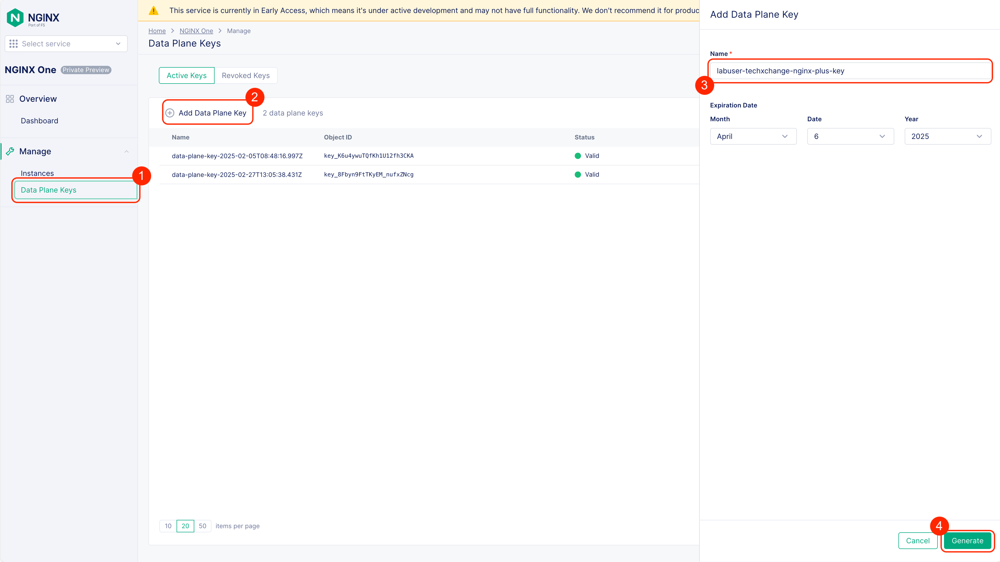

5.  The Data Plane Key will be displayed. Click the “Copy” icon to copy
    the key to the clipboard. 
    
    > :warning: **Warning:** *SAVE THIS KEY SOMEWHERE SAFE.* There is
    > no way to retrieve the key after you click close.

    

## Installing NGINX Agent

1.  Connect to the “NGINX Plus” instance in UDF, either directly through
    SSH or through the jumphost. If connecting through the jumphost, the
    SSH command will be:

    ```bash
ssh ubuntu@10.1.1.4
    ```

2.  Because the hostname is used as the instance's name in NGINX One,
    you should change it to something that that identifies the host
    belongs to your. Ensure that you are working on the NGINX Plus
    instance (default hostname ip-10-1-1-4), and run the following
    command, substituting “\<yourname\>” with a string that identifies
    you as the user. Use only lowercase characters and hyphens. Note
    that the bash prompt will not update immediately; it will continue
    showing the previous hostname until you log out and log back in.
    This does not affect the lab.

    ```bash
sudo hostname <yourname>-techxchange-nginx-plus
    ```

    > :point_right: **Note:** If you don't change the hostname, it will
    > appear as `ip-10-1-1-4` in the console, along with everybody
    > else who didn't change the hostname, and you won't be able to
    > easily identify your instance later.

3.  Observe the running NGINX instance on this machine.

    1.  If you are working from the jumphost, open the Chromium browser
        and navigate to <http://10.1.1.4>

    2.  If you are connecting directly through UDF, locate the “NGINX
        Plus” component and select the “NGINX HTTP” access method.

    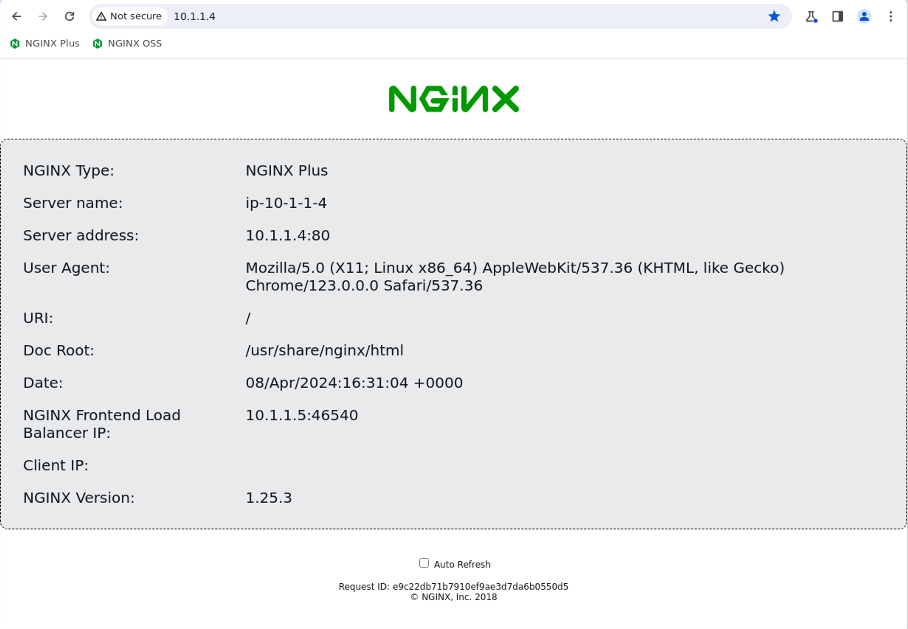

4.  From the NGINX Plus instance, run the following command to install
    the NGINX Agent. Substitute \<data plane key\> with the key you
    saved in step 5. Make sure you are working on the NGINX Plus
    instance; if you accidentally install on the jumphost, the
    installation will succeed, but there will be no NGINX instance for
    the agent to connect to and the instance will appear as “Offline”.
    If this occurs, return to step 1 and create a new Data Plane Key.

    ```bash
curl https://agent.connect.nginx.com/nginx-agent/install \|
DATA_PLANE_KEY=<data plane key> sh -s -- -y
    ```

    The install script will install any necessary dependencies and install
    the NGINX Agent with the appropriate settings for your system. You will
    see a warning about “stub_status” not being configured. You can ignore
    that warning for the moment.

5.  Return to the NGINX One console. From the left menu in the “Manage”
    section, click “Instances”.

6.  You should see your new instance in the list. Click its hostname to
    view the instance details.

    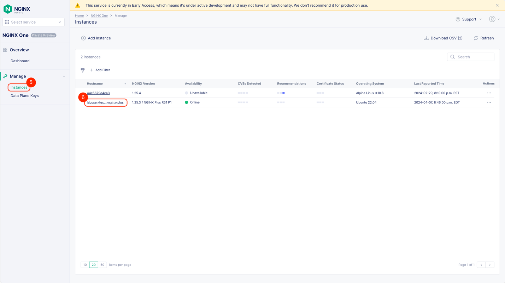

7.  Explore the instance details:

    

# Lab 3: Configuration Suggestions

In the previous lab, the NGINX Agent installer provided a warning that
there was no stub_status found in the NGINX config. We’ll make that
change on the NGINX Plus instance, and see the change reflected in NGINX
One.

## Adding a stub_status directive

1.  From either the jumphost or directly through UDF, SSH into the NGINX
    Plus instance (10.1.1.4).

2.  Using your editor of choice, edit the “/etc/nginx/conf.d/demo.conf”
    file to include a location block at the end of the server block with
    the “stub_status” directive. You will need to use sudo to edit the
    file For example:  
      
    vi:
    ```bash
sudo vi /etc/nginx/conf.d/demo.conf
    ```

    nano:
    ```bash
sudo nano /etc/nginx/conf.d/demo.conf
    ```

    Add the following location block to the server block:
    ```
    location = /basic_status {
        stub_status;
    }
    ```

    The file should like this:
    ```
server {
    listen 80 default_server;
    server_name app_server;

    root /usr/share/nginx/html;
    error_log /var/log/nginx/app-server-error.log notice;
    index demo-index.html index.html;
    expires -1;

    sub_filter_once off;
    sub_filter 'server_hostname' '\$hostname';
    sub_filter 'server_address' '\$server_addr:\$server_port';
    sub_filter 'server_url' '\$request_uri';
    sub_filter 'remote_addr' '\$remote_addr:\$remote_port';
    sub_filter 'server_date' '\$time_local';
    sub_filter 'client_browser' '\$http_user_agent';
    sub_filter 'request_id' '\$request_id';
    sub_filter 'nginx_version' '\$nginx_version';
    sub_filter 'document_root' '\$document_root';
    sub_filter 'proxied_for_ip' '\$http_x_forwarded_for';

    location = /basic_status {
        stub_status;
    }
}
    ```

3.  Reload the NGINX Plus configuration with the following command:

    ```bash
sudo nginx -s reload
    ```

4.  Check that the stub_status module is working.

    1.  If you are working through the jumphost, open Chromium and
        navigate to <http://10.1.1.4/basic_status>

    2.  If you are connecting directly through UDF, locate the “NGINX
        Plus” component and select the “NGINX HTTP” access method.
        Append “/basic_status” to the end of the address.

    

5.  Refresh the instance details in the NGINX One console.

    

Notice that NGINX One has identified a potential configuration issue:
the newly-added stub_status page is open to the world. We can remediate
this by adding an ACL to the /basic_status location block.

6.  Edit the “/etc/nginx/conf.d/demo.conf”again and update the
    /basic_status location block to match the following:

    ```
location = /basic_status {  
    stub_status;  
    allow 10.0.0.0/8;  
    deny all;  
}
    ```

7.  Reload the NGINX Plus configuration with the following command:

    ```bash
sudo nginx -s reload
    ```

8.  Refresh the instance details in the NGINX One console. You should
    see that the configuration recommendation is no longer shown.

    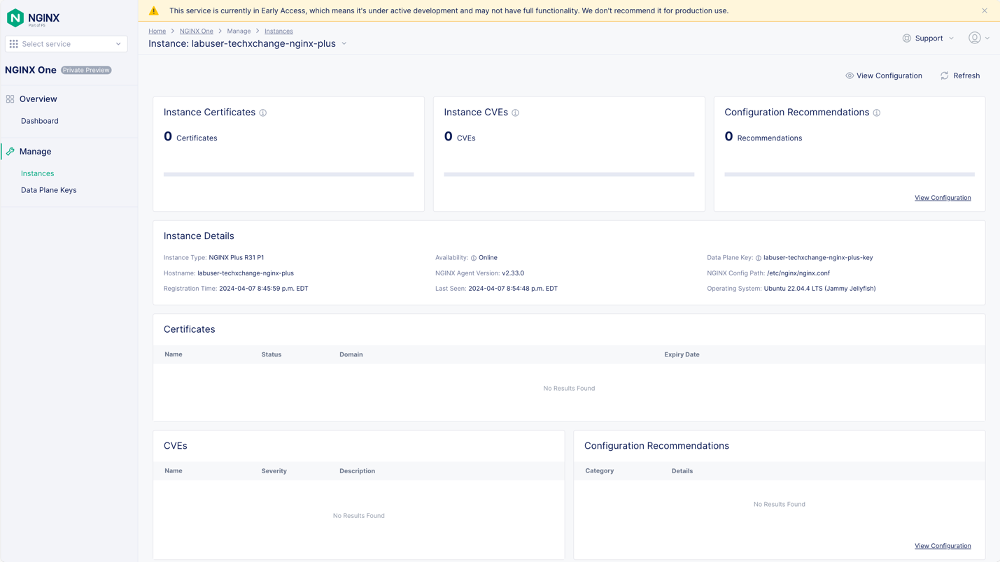

## Adding a TLS certificate

1.  Back on the NGINX Plus instance, edit the
    “/etc/nginx/conf.d/demo.conf” file again and add the following to
    the server block:

    ```
listen 443 ssl;  
ssl_certificate /etc/nginx/ssl/nginx.crt;  
ssl_certificate_key /etc/nginx/ssl/nginx.key;
    ```

    The entire file should now look as follows:

    ```
server {  
    listen 80 default_server;  
    server_name app_server;  
    
    listen 443 ssl;  
    ssl_certificate /etc/nginx/ssl/nginx.crt;  
    ssl_certificate_key /etc/nginx/ssl/nginx.key;  
    
    root /usr/share/nginx/html;  
    error_log /var/log/nginx/app-server-error.log notice;  
    index demo-index.html index.html;  
    expires -1;  
    
    sub_filter_once off;  
    sub_filter 'server_hostname' '\$hostname';  
    sub_filter 'server_address' '\$server_addr:\$server_port';  
    sub_filter 'server_url' '\$request_uri';  
    sub_filter 'remote_addr' '\$remote_addr:\$remote_port';  
    sub_filter 'server_date' '\$time_local';  
    sub_filter 'client_browser' '\$http_user_agent';  
    sub_filter 'request_id' '\$request_id';  
    sub_filter 'nginx_version' '\$nginx_version';  
    sub_filter 'document_root' '\$document_root';  
    sub_filter 'proxied_for_ip' '\$http_x_forwarded_for';  
    
    location = /basic_status {  
        stub_status;  
        allow 10.0.0.0/8;  
        deny all;  
    }  
}
    ```

2.  Reload the NGINX Plus configuration with the following command:

    ```bash
sudo nginx -s reload
    ```

3.  Refresh the instance status in the NGINX One console. You should now
    see the certificate, and the validity status, as well as a new
    recommendation.

4.  You can view the configuration, and recommendations, by clicking the
    “View Configuration” link in the “Configuration Recommendations”
    section. Currently NGINX One can only view configurations.

    

5.  Select the “demo.conf” file from the file picker. Note the blue dots
    and the number “1” next to demo.conf; the configuration viewer
    highlights the location(s) of any recommendations it has for the
    NGINX configuration.

    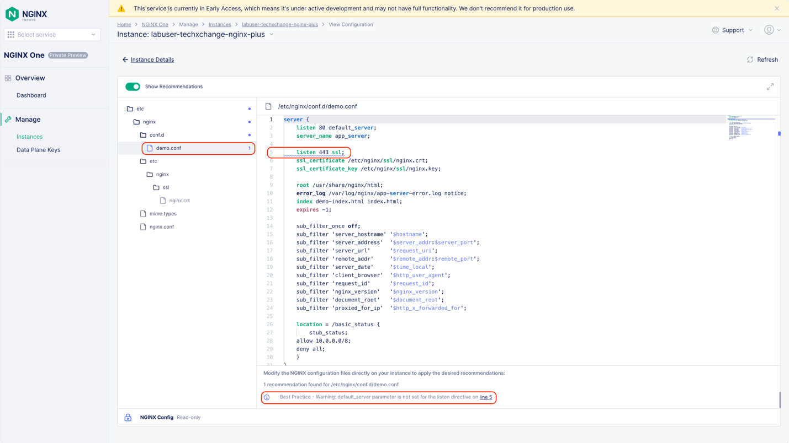

# Lab 4: NGINX OSS

NGINX Agent isn’t limited to NGINX Plus; it can also be installed into
NGINX Open Source instances. The UDF blueprint contains a second Ubuntu
host with the package maintainer’s version of NGINX installed.

## Generating a Data Plane Key

1.  From the NGINX One console, in the left hand menu under the “Manage”
    section, select “Data Pane Keys”.

2.  Click “Add Data Plane Key”.

3.  Give the key a name. Other users in your tenant will see this
    object, so be sure to name it in a way that identifies it as yours.
    A suggested format is “\<yourname\>-techxchange-nginx-oss-key”.

4.  Click “Generate”

    
    
    > :point_right: **Note:** You are working in a shared tenant; keep
    > track of your resources, and be careful not to accidently modify
    > anyone else's.

5.  The Data Plane Key will be displayed. Click the “Copy” icon to copy
    the key to the clipboard.
        
    > :warning: **Warning:** *SAVE THIS KEY SOMEWHERE SAFE.* There is
    > no way to retrieve the key after you click close.

    

## Installing NGINX Agent

1.  Connect to the “NGINX OSS” instance in UDF, either directly through
    SSH or through the jumphost. If connecting through the jumphost, the
    SSH command will be:

    ```bash
ssh ubuntu@10.1.1.6
    ```

2.  Because the hostname is used as the name of the instance in NGINX
    One, you should change the hostname to something that identifies it
    as yours. Ensure that you are working on the NGINX OSS instance
    (default hostname ip-10.1.1.6), and run the following command,
    substituting “\<yourname\>” with a string that identifies you as a
    user. Use only lowercase characters and hyphens. Note that the bash
    prompt will not update immediately; it will continue to show the
    previous hostname unless you log out and log back in. This does not
    affect the lab.

    ```bash
sudo hostname <yourname>-techxchange-nginx-oss
    ```

3.  Observe the running NGINX instance on this machine.

    1.  If you are working from the jumphost, open the Chromium browser
        and navigate to <http://10.1.1.6/>

    2.  If you are connecting directly through UDF, locate the “NGINX
        OSS” component and select the “NGINX HTTP” access method.

    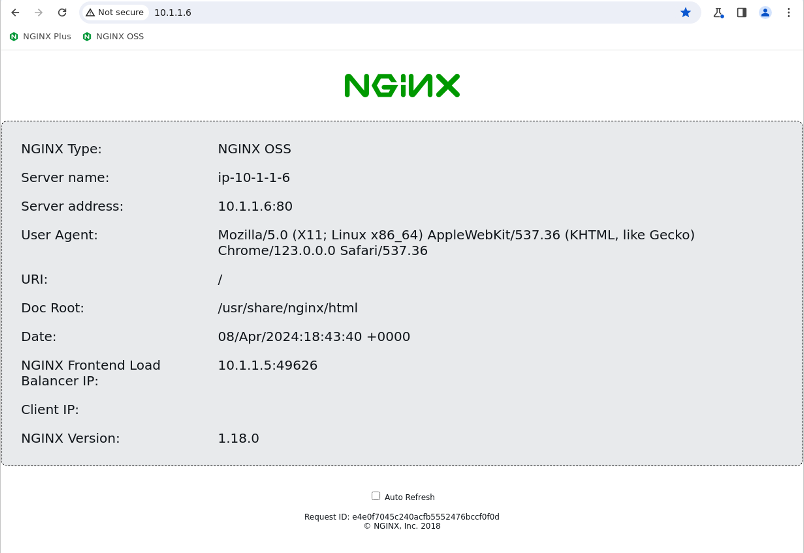

4.  From the NGINX OSS instance, run the following command to install
    the NGINX Agent. Substitute \<data plane key\> with the key you
    saved in step 5. Make sure you are working on the NGINX OSS
    instance; if you accidentally install on the jumphost, the
    installation will succeed, but there will be no NGINX instance for
    the agent to connect to and the instance will appear as “Offline”.
    If this occurs, return to step 1 and create a new Data Plane Key.

    ```
curl https://agent.connect.nginx.com/nginx-agent/install \|
DATA_PLANE_KEY="<data plane key>" sh -s -- -y
    ```
    The install script will install any necessary dependencies, and install
    the NGINX Agent with the appropriate settings for your system. You will
    see a warning about “stub_status” not being configured. You can ignore
    that warning.

5.  Return to the NGINX One console. From the left menu in the “Manage”
    section, click “Instances”. You should see your new instance in the
    list.

6.  Click its hostname to view the instance details.

    

7.  Explore the instance details.

    

    Note that this instance has a different set of configuration
    recommendations than the vanilla NGINX Plus instance did. Package
    maintainers may ship NGINX with their own sets of defaults, which may or
    may not align with best practices. NGINX One provides a centralized view
    of such recommendations across the organization.

# Lab Cleanup

1.  From the NGINX One console, in the left-hand menu in the “Manage”
    section, select “Data Plane Keys”

2.  Select the context menu for the Data Plane Key for your NGINX OSS
    instance, and select “Revoke”. 
    
    > :warning: **Warning:** Make sure you are revoking your own
    > key and not someone else’s.

    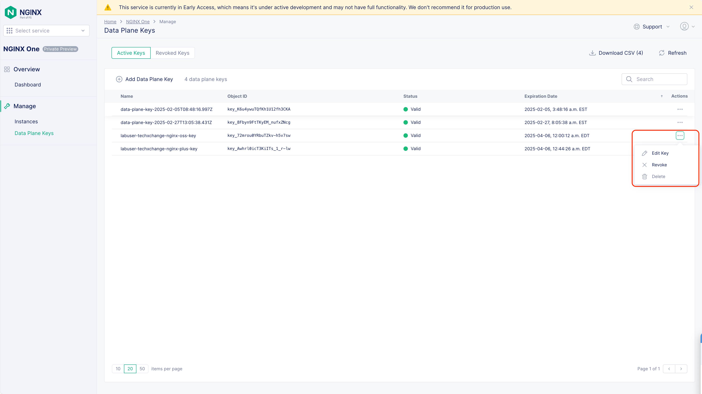

3.  Confirm the revocation.

    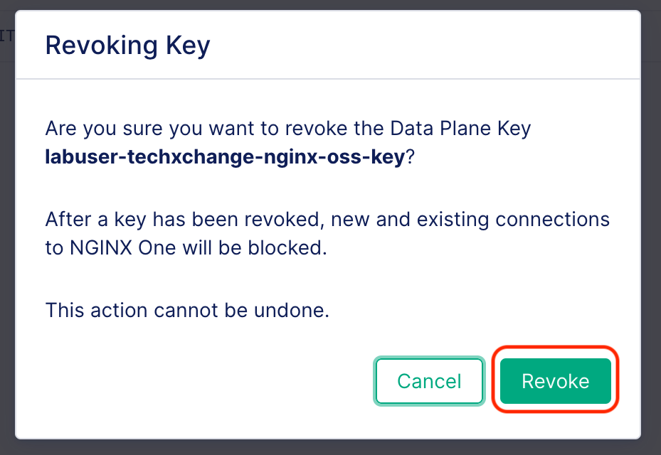

4.  Repeat steps 2 and 3 for the NGINX Plus instance.

5.  From the left-hand menu in the “Manage” section, select “Instances”.

6.  Select the context menu for the NGINX OSS instance, and select
    “Delete”. 
    
    > :warning: **Warning:** Make sure you are deleting your own 
    > instance and not someone else’s.

    

7.  Confirm the deletion.

    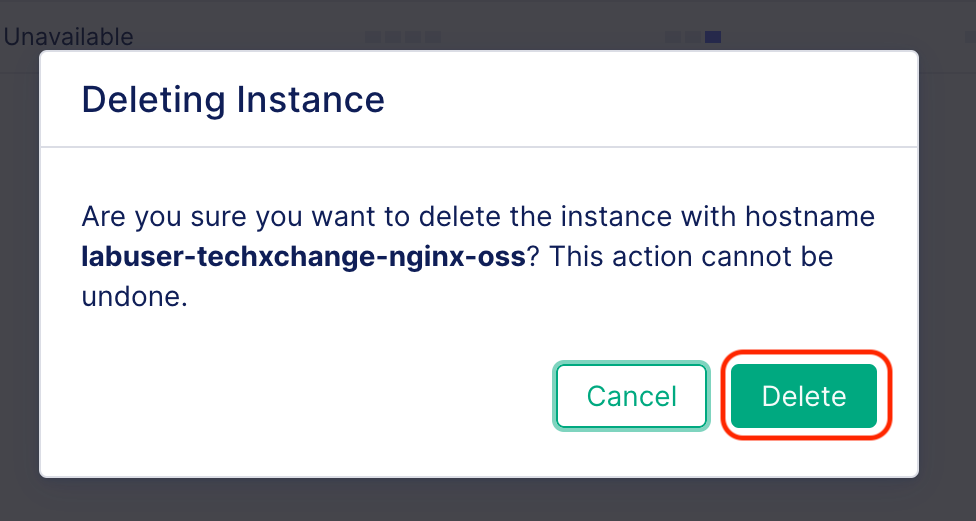

8.  Repeat steps 6 and 7 for the NGINX Plus instance.
